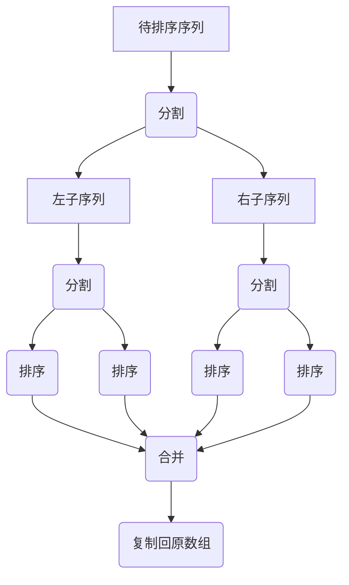

## 原理

归并排序是一种常见的排序算法，其基本思想是将待排序的序列递归地分成两部分，分别进行排序，然后将两个有序的子序列合并成一个有序的序列。这个过程可以看做是一颗二叉树，树的深度为log(n)，其中n是待排序序列的长度，每个节点表示一次合并操作，左右子节点分别表示左右子序列的排序过程。

以下是归并排序的具体步骤：

1. 分割：将待排序的序列从中间分成两个子序列，然后对左右两个子序列分别递归地进行归并排序，直到每个子序列只有一个元素为止。
2. 合并：将两个有序的子序列合并成一个有序的序列。具体做法是，定义一个辅助数组，将两个子序列中较小的元素依次放入辅助数组中，直到其中一个子序列被取完，然后将剩余的元素依次放入辅助数组中即可。
3. 将辅助数组中的元素复制回原数组中。


下面是归并排序的流程图，使用markdown语法展示：




归并排序的时间复杂度为O(nlogn)，其中n是待排序序列的长度。归并排序比较稳定，而且可以用于大规模数据的排序，因此在实际应用中被广泛使用。与快速排序相比，归并排序的时间复杂度虽然相同，但由于归并排序不需要进行递归调用，因此它的空间复杂度要比快速排序高。

## 实现

```go
func mergeSort(arr []int) []int {
    if len(arr) <= 1 {
        return arr
    }
    mid := len(arr) / 2
    left := mergeSort(arr[:mid])
    right := mergeSort(arr[mid:])
    return merge(left, right)
}

func merge(left []int, right []int) []int {
    res := make([]int, len(left)+len(right))
    i, j, k := 0, 0, 0
    for i < len(left) && j < len(right) {
        if left[i] <= right[j] {
            res[k] = left[i]
            i++
        } else {
            res[k] = right[j]
            j++
        }
        k++
    }
    for i < len(left) {
        res[k] = left[i]
        i++
        k++
    }
    for j < len(right) {
        res[k] = right[j]
        j++
        k++
    }
    return res
}
arr := []int{3, 5, 4, 1, 2}
sorted := mergeSort(arr)
fmt.Println(sorted) // [1 2 3 4 5]
```


这里使用了Go语言的切片（slice）来表示数组，使用递归的方式实现归并排序，并在合并两个有序序列时使用了归并排序中的辅助数组。在合并两个有序序列时，使用了三个指针i、j、k来分别指向左序列、右序列、辅助数组中的位置。代码中的merge函数中，分别遍历左右两个序列中的元素，将较小的元素放入辅助数组中，最后将辅助数组中的元素复制回原数组即可。

## 效率对比

接下来是归并排序和快速排序的时间复杂度对比：

1. 归并排序的时间复杂度为O(nlogn)，其中n是待排序序列的长度，因此归并排序的时间复杂度是稳定的。
2. 快速排序的时间复杂度也为O(nlogn)，但是在最坏情况下（即待排序序列已经有序或者基本有序），快速排序的时间复杂度会退化为O(n^2)。
3. 归并排序的空间复杂度为O(n)，因为在归并过程中需要使用一个辅助数组来合并两个有序的子序列。
4. 快速排序的空间复杂度为O(logn)，因为在快排的递归过程中，需要使用一个栈来存储每一层递归调用所需要的参数。

## 总结

因此，归并排序相对于快速排序来说，在时间复杂度和空间复杂度上都更加稳定。但是在实际应用中，快速排序的常数项比归并排序小，因此对于小规模数据的排序，快速排序的效率可能更高。同时，由于归并排序需要使用额外的辅助数组，因此它的空间开销也更大。所以，在具体应用中，需要根据实际情况选择适合的排序算法。